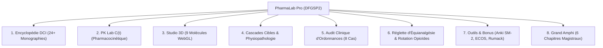

# 🏥 PharmaLab Pro • Plateforme d'Excellence en Pharmacologie des Antalgiques

[](https://pharmalab-pro-dfgsp2.vercel.app)
[](https://pharmalab-pro-dfgsp2.vercel.app)
[](https://pharmalab-pro-dfgsp2.vercel.app)

> **Outil pédagogique et clinique d'élite conçu pour les étudiants en pharmacie visant la place de Major de Promotion.**  
> Comprendre la pharmacologie non pas par un apprentissage passif, mais par la biochimie structurale 3D, les relations structure-activité (RSA), la dynamique des cascades moléculaires et l'audit rigoureux d'ordonnances.

---

## 🌐 Démonstration en Ligne

L'application est déployée en production et accessible sur tous les appareils (smartphone, tablette, PC) :  
👉 **[https://pharmalab-pro-dfgsp2.vercel.app](https://pharmalab-pro-dfgsp2.vercel.app)**

*Capacité PWA : Installable en 1 clic sur l'écran d'accueil iPhone et Android pour un usage 100 % hors-ligne.*

---

## ✨ Les 8 Grands Modules de la Plateforme



### 1. 📚 Encyclopédie Monographique (24+ DCI)
Fiches cliniques exhaustives pour chaque molécule du programme :
* **Palier I** : Paracétamol, Aspirine, Ibuprofène, Kétoprofène, Célécoxib, Néfopam, Naproxène, Diclofénac.
* **Palier II** : Codéine, Tramadol, Dihydrocodéine, Poudre d'Opium.
* **Palier III** : Morphine, Oxycodone, Fentanyl, Hydromorphone, Buprénorphine, Méthadone.
* **Co-analgésiques / Adjuvants** : Prégabaline, Gabapentine, Amitriptyline, Duloxétine, Phloroglucinol.
* **Antidotes Spécifiques** : Naloxone, N-Acétylcystéine (NAC).

### 2. 📈 Laboratoire de Pharmacocinétique (PK Lab C(t))
* Traceur interactif de courbes de concentration plasmatique $C(t)$ (modèle monocompartimental à absorption extravasculaire).
* Modulation en direct de la dose, de la voie d'administration (PO vs IV), du $V_d$ et de la fonction rénale (clairance glomérulaire Cockcroft-Gault).

### 3. 🔬 Studio 3D & Pharmacophores (3Dmol.js)
* Visualisation 3D WebGL temps réel de 9 molécules clés (Paracétamol, Aspirine, Ibuprofène, Célécoxib, Codéine, Tramadol, Morphine, Fentanyl, Naloxone).
* Mise en évidence des pharmacophores critiques et des acides aminés catalytiques clés (**Ser529/Ser516**, **Ile523/Val523**, **Asp147/His297**).

### 4. ⚡ Cascades Cibles & Shunt Métabolique
* Simulation de la voie de l'acide arachidonique : inhibition de COX-1 vs COX-2.
* Démonstration du **Syndrome de Widal (Triade de Samter)** : déviation du substrat vers la 5-Lipoxygénase et orage de leucotriènes ($LTC_4, LTD_4, LTE_4$).
* Synapse opioïde : bifurcation Protéine $G_i$ (analgésie) versus $\beta$-Arrestine 2 (tolérance et dépression respiratoire).

### 5. 🩺 Audit Clinique d'Ordonnances (8 Cas de Haut Vol)
1. **Amina (28 ans)** : Grossesse 31 SA & AINS (Fermeture du canal artériel & anurie fœtale).
2. **Gérard (74 ans)** : Poussée d'arthrose sous IEC + Diurétique (Le redoutable *Triple Whammy* rénal).
3. **Thomas (35 ans)** : Tramadol + Paroxétine (Syndrome sérotoninergique & inhibition du CYP2D6).
4. **Christian (62 ans)** : Titration de Morphine LP en oncologie & calcul des interdoses.
5. **Sophie (42 ans)** : Trouble bipolaire sous Lithium & AINS (Effondrement de l'excrétion rénale du $Li^+$).
6. **Julien (6 ans)** : Varicelle fébrile & AINS (Risque dramatique de fasciite nécrosante streptococcique).
7. **Patrick (68 ans)** : Douleur neuropathique post-zostérienne (Score DN4 $\ge 4/10$ & Gabapentinoïdes).
8. **Marie (22 ans)** : Intoxication aiguë Paracétamol 15g (Nomogramme de Rumack-Matthew & protocole de Prescott).

### 6. ⚖️ Réglette Tactique d'Équianalgésie & Rotation des Opioïdes
* Calculateur officiel de conversion en Équivalent Morphine Orale (ÉMO).
* Abattement systématique de sécurité de **-30 % à -50 %** pour prévenir la tolérance croisée incomplète.
* Calcul automatique de la dose de secours (interdose = $1/6^{\text{e}}$ de la dose journalière).

### 7. 🎁 Outils Pédagogiques Avancés & Spaced Repetition (SRS)
* **Flashcards Anki SM-2** : Algorithme de répétition espacée basé sur l'intervalle optimal de rétention mnésique.
* **Simulateur ECOS** : Stations d'Examen Clinique Objectif Structuré avec patient virtuel.
* **Nomogramme de Rumack-Matthew Interactif** : Ligne de toxicité hépatique à H4 et déclenchement de la NAC.
* **Mode Garde d'Urgence (Time-Attack 90s)** : Épreuve de rapidité sous chrono.
* **Audio-Learning (Web Speech API)** : Fiches audios pour réviser en marchant ou dans les transports.

### 8. 🏛️ Le Grand Amphi & Décodeur de Mécanismes
6 chapitres de cours magistral approfondi avec décryptage biochimique et anatomique :
* Neurobiologie de la nociception, fibres $A\delta/C$ et *Gate Control*.
* Le mystère du paracétamol et la synthèse centrale de l'AM404.
* La chimie fine de la COX et le shunt de Widal.
* L'hémodynamique rénale et l'insuffisance rénale fonctionnelle.
* L'agonisme biaisé du récepteur $\mu$ et la pharmacogénomique du CYP2D6.
* La toxicologie d'urgence (Prescott, demi-vie de la naloxone et re-narcotisation).

---

## 🛠️ Stack Technique

* **Interface & Styles** : Tailwind CSS, CSS3 Glassmorphism, Google Fonts (Plus Jakarta Sans & JetBrains Mono).
* **Moteur 3D Moléculaire** : 3Dmol.js (WebGL, parsing de fichiers SDF PubChem natifs).
* **Graphiques Pharmacocinétiques** : Chart.js.
* **Icônes** : Lucide Icons.
* **PWA & Offline** : Service Worker natif (`sw.js`), Web App Manifest (`manifest.json`), cache-first strategy.
* **Hébergement & CDN** : Vercel Edge Network.

---

## 💻 Lancement Local

Pour exécuter la plateforme en local :
```bash
# 1. Cloner le dépôt
git clone git@github.com:Tomota113/pharmalab-pro.git
cd pharmalab-pro

# 2. Lancer le serveur local (zéro dépendance, utilise Python 3 standard)
./start.sh
```
Puis ouvrir `http://localhost:8080` dans votre navigateur.

---

## 👨‍⚕️ Auteur & Licence

Développé par **Ibrahim Tomota** ([@Tomota113](https://github.com/Tomota113)).  
Projet sous licence MIT — Conçu pour l'excellence académique en pharmacologie médicale.
